# Library Management System

## Overview
[Library Management System](https://library-management-system.herokuapp.com/) is a Python CLI application designed to manage a library's book inventory using a Google Spreadsheet API. The library management system allows the librarian to add and remove, check out and return books, as well as to view the list of all books in the library stock sorted by specific fields (author, title, genre, etc.) or view the list of books that are currently checked out or overdue.

The app is built based on the MVC model that allows separating access to the data and operations on it from the user interface.

The app uses the Pydantic model for data validation which provides a convenient way to validate data using type hints and provides clear error messages if the data is invalid.

[App link](https://library-management-system.herokuapp.com/)

[SpreadSheet](https://docs.google.com/spreadsheets/d/1guVUVRVMsu2nebKllN6_58nDraMnEftIoTaRtlUnRME/edit?usp=sharing)

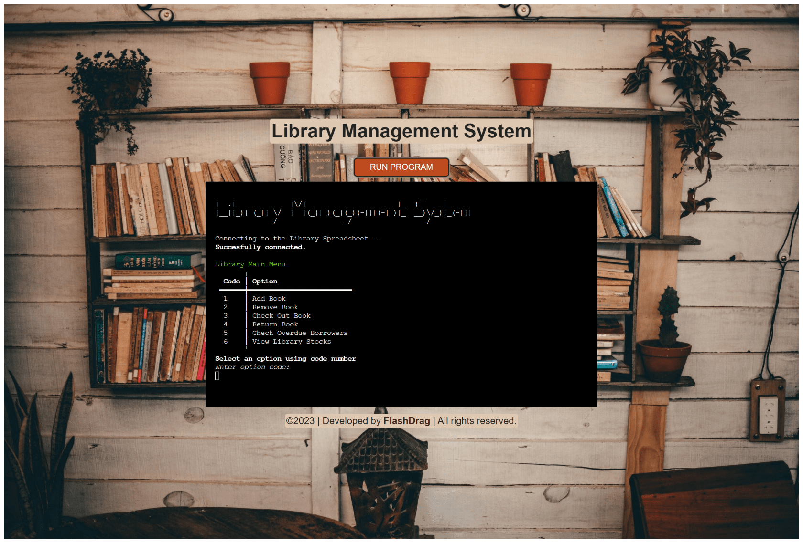

## Table of Contents
- [**User Experience UX**](#user-experience-ux)
  - [User Stories](#user-stories)
  - [Structure](#structure)
  - [Flowchart](#flowchart)
- [**Features**](#features)
  - [App features](#app-features)
    - [Main menu](#main-menu)
    - [Add book](#add-book)
    - [Remove book](#remove-book)
    - [Check out book](#check-out-book)
    - [Return book](#return-book)
    - [Check Overdue borrowers](#check-overdue-borrowers)
    - [View library stock](#view-library-stock)
  - [Development features](#development-features)
    - [MVC Model](#mvc-model)
    - [API Integration](#api-integration)
    - [Data model](#data-model)
    - [Type Hints](#type-hints)
    - [Pydantic Validation](#pydantic-validation)
    - [Enum, TypedDict](#enum-typeddict)
    - [Rich table](#rich-table)
    - [Logging](#logging)
    - [Error handling](#error-handling)
- [**Technologies Used**](#technologies-used)
- [**Testing**](#testing)
- [**Deployment**](#deployment)
- [**Credits**](#credits)

## User Experience (UX)

### User Stories
- #### Librarian goals
    - As a librarian, I want to be able to add a new book to the library stock.
    - As a librarian, I want to be able to add some copies of a existed book to the library stock by specific field (ISBN, title, author, etc.)

    - As a librarian, I want to be able to remove some copies of a existed book from the library stock.
    - As a librarian, I want to be able to completely remove a book from the library stock.

    - As a librarian, I want to be able to check out a book for a specific borrower.
    - As a librarian, I want to be able to return a book to the library.

    - As a librarian, I want to be able to see the list of all books in the library stock.
    - As a librarian, I want to be able to see the list of books sorted by specific field (author, title, genre, date etc.) in the library stock.

    - As a librarian, I want to be able to see the all books that are currently checked out.
    - As a librarian, I want to be able to see the list of books that are currently checked out sorted by specific field (title, borrower, borrow_date, due_date etc.) in the `borrowed` worksheet.
    - As a librarian, I want to be able to see the list of books that are overdue.

[Back to top](#table-of-contents)

### Structure
The library management system is a terminal-based application that is presented in a one-page menu. The main menu is displayed when the app is launched. Each menu provide a list of options to the user in tabular format. Each option is represented by a code number to be entered by the user. The user can enter the code number of the option they want to choose. The app will then perform the action associated with that option. The code approach allows the user to navigate the app without having to type in full words or letters, which makes the app more user-friendly and easier to use.

#### Flowchart
The flowchart was designed in [Microsoft Visio](). It shows the main flow of the app and the main functions that are used to perform the actions.

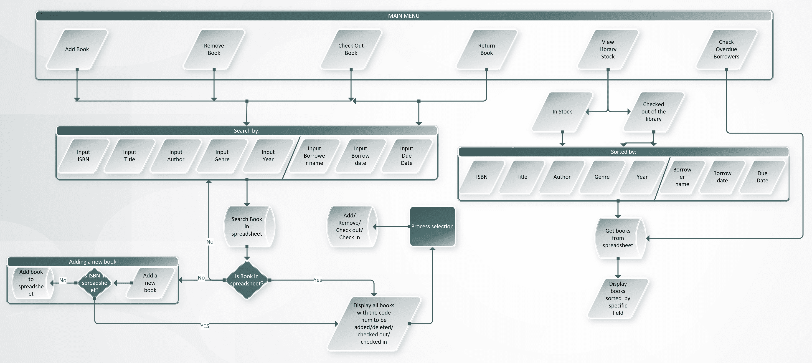

## Features

### App features

#### Main menu
  The main menu is the first screen that the user sees when the app is launched. It provides a list of options to the user in tabular format. Each option is represented by a code number to be entered by the user. The user can enter the code number of the option they want to choose. The app will then perform the action associated with that option.

The main menu provides the following options

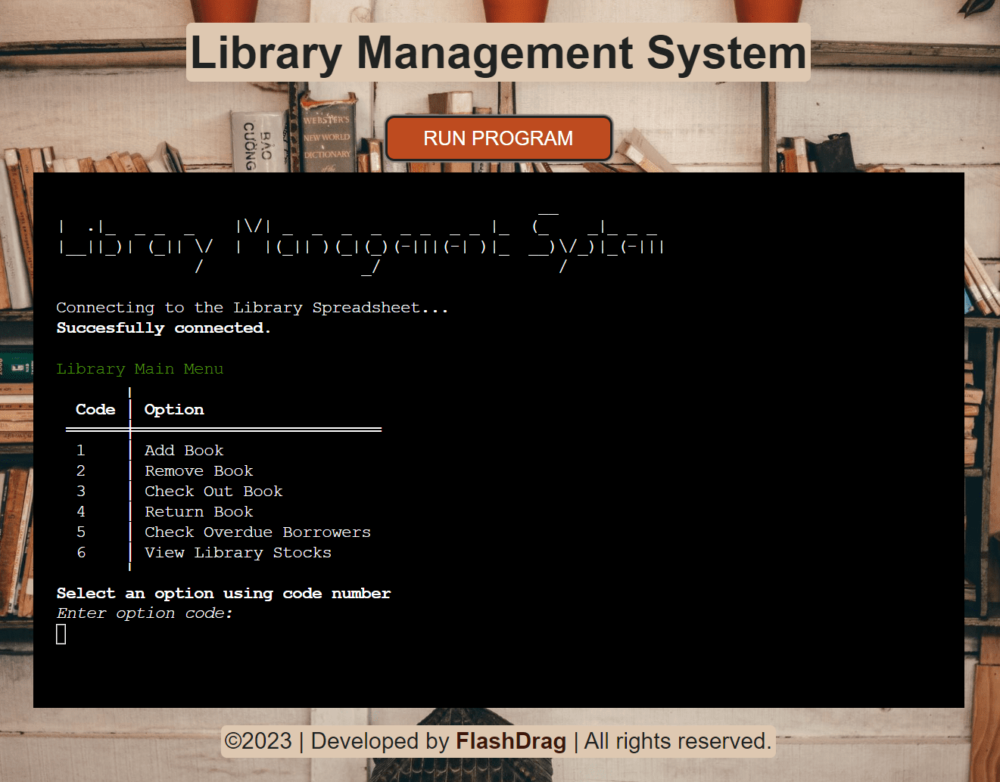

- #### Add book
  The `Add book` option allows the librarian to add a book to the library stock. The librarian can add a new book or add some copies of a existed book to the library stock by specific field (ISBN, title, author, etc.).

  Librarian can choose the field to search by. Then the librarian will be asked to enter the value of the field to search for. If value is valid, the book will be searched for in the `stock` worksheet by the selected field and validated value. All found books that match entered value in the selected specific field column will be displayed in tabular format and the librarian will be prompted to select a book to add copies to.

  If initially, the first selected field was `ISBN` and book not found, the user will be prompted to enter the rest book details manually (title, author, genre, year and number of copies).

  If initially, the first selected field other than `ISBN` and book not found, the user will be prompted to enter the book `ISBN` and the rest book details manually (title, author, genre, year and number of copies). After receiving the `ISBN` value, the app will search for the book with the same `ISBN` in the `stock` worksheet. If the book with the same `ISBN` already exists in the `stock` worksheet, the user cannot add a new book with the same `ISBN` and existing book will be displayed to the user and the user will be asked to choose the book to add copies to.

  After the user has selected the book to add copies to, the app will prompts the user to enter the number of copies to add. If the number of copies is valid (must be digit and in range 1-10), the number of copies will be added to the selected book and the book will be updated in the `stock` worksheet.
  Updated book will be displayed to the user with the full information about the book, updated number of copies and number of row in the `stock` worksheet.

Add book

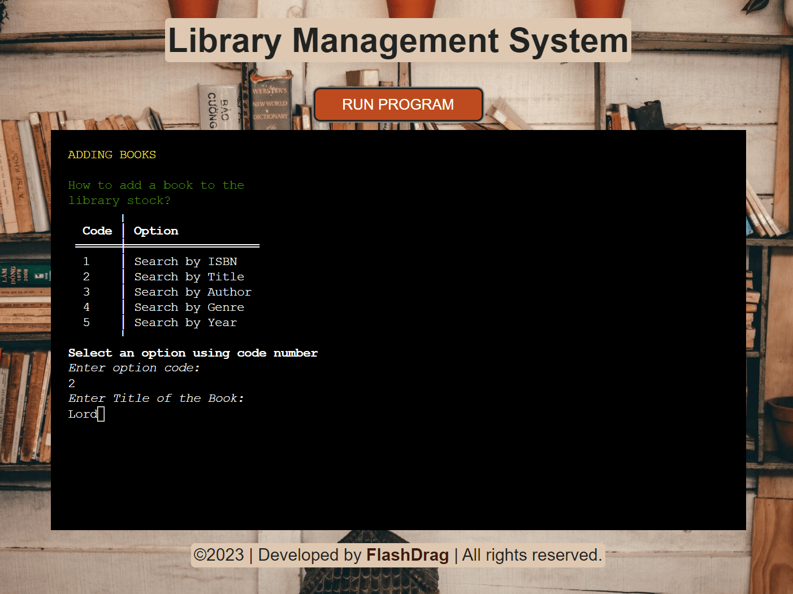

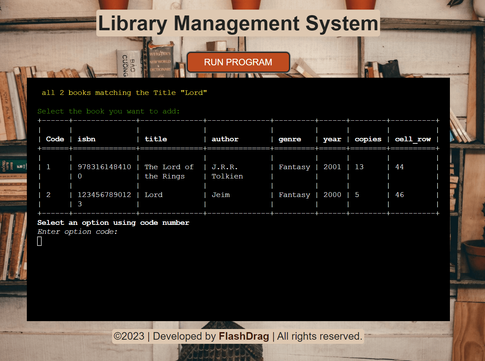

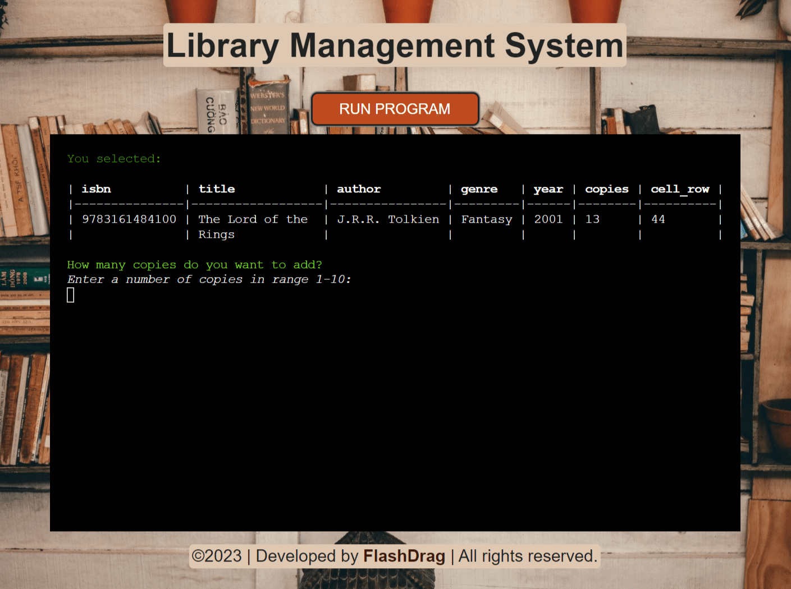

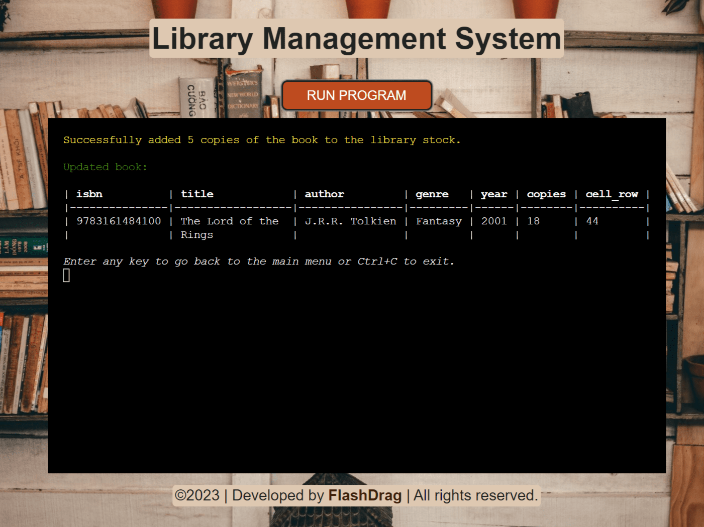

- #### Remove book
  The `Remove book` option allows the librarian to remove a book from the library stock. The librarian can remove some copies of a existed book or completely remove a book from the library stock.

  Librarian can choose the field to search by. Book will be searched for in the `stock` worksheet by the selected field and validated value. All found books that match entered value in the selected specific field column will be displayed in tabular format and the librarian will be prompted to select a book to remove copies from or completely remove the book.

  If the book has no copies left, the book will be completely removed from the `stock` worksheet and the user will be notified.

  If the book value not found, the user will be notified that no books match the entered value in the selected specific field column and then returned to field selection.

  If the user removes some copies of a book, and the book has some copies left, the book will be updated in the `stock` worksheet and the updated book will be displayed to the user with the full information about the book, updated number of copies and number of row in the `stock` worksheet.

Remove book

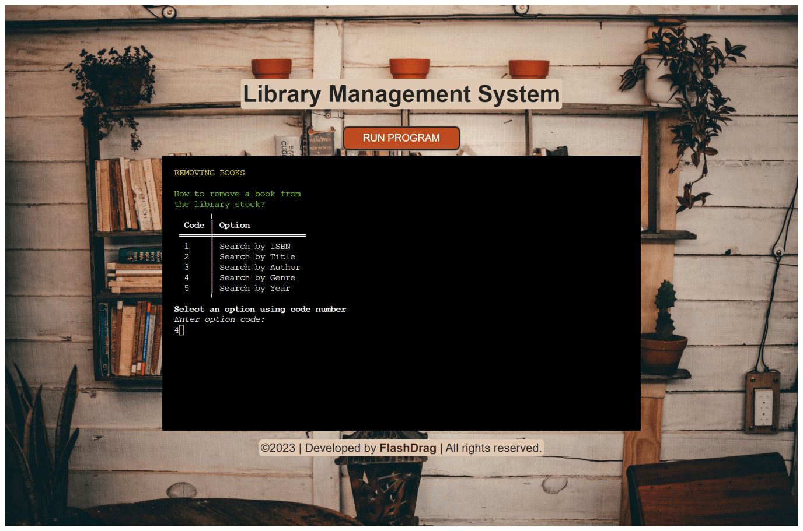

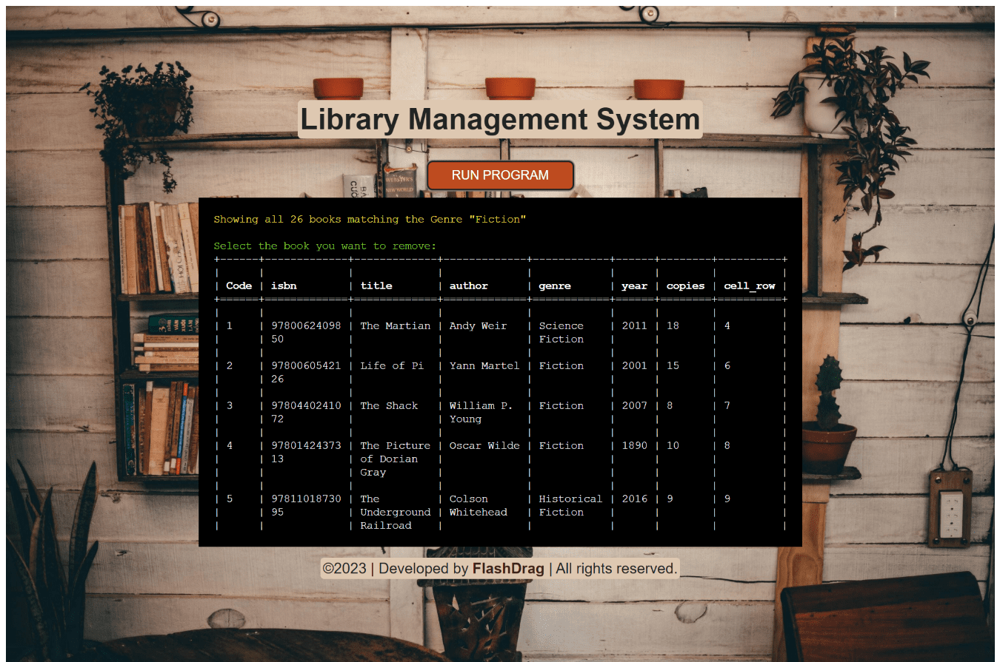

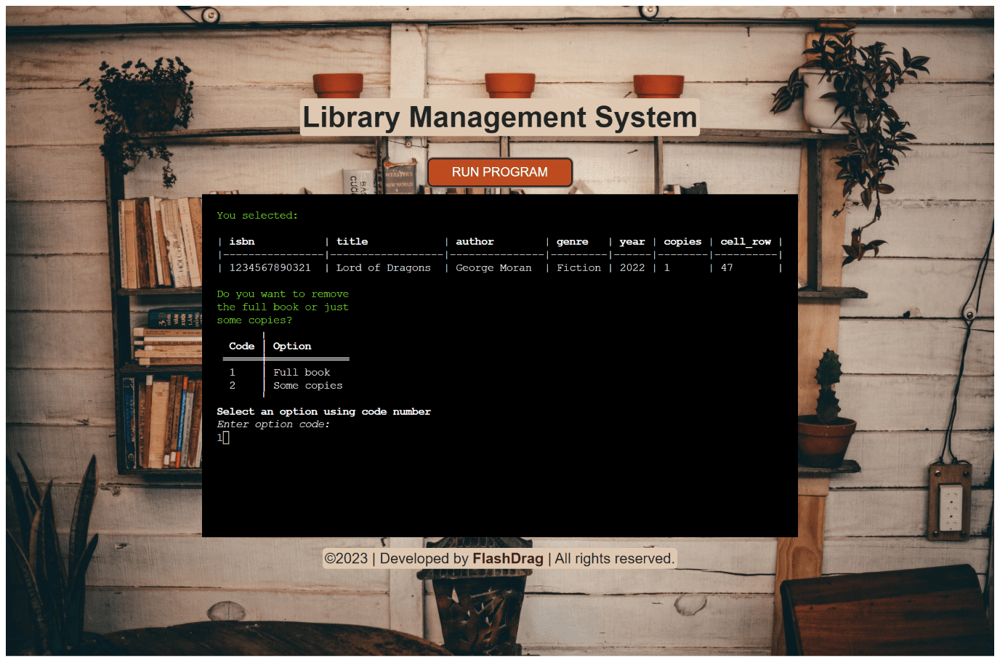

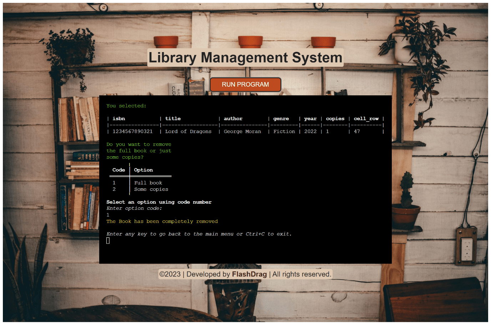

---

<i>Another example of removing book.</i>

Completely removing a book if entered number of copies to remove is equal or greater than the number of copies in the library stock.

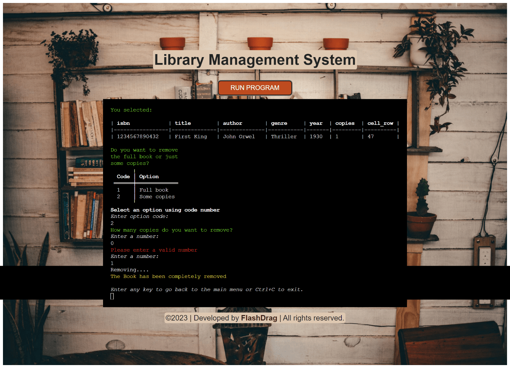

---

<i>Another example of removing book.</i>

Removing some copies of a book.

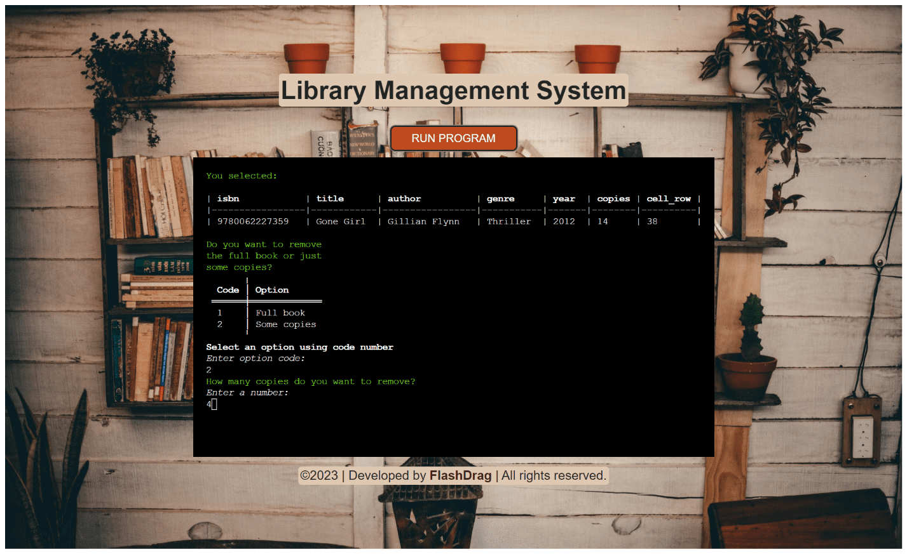

- #### Check out book
The check out book option allows the librarian to check out a book to a borrower. Check out system uses the same search system as the `Add book` and `Remove book` options. The librarian can choose the field to search by. The book will be searched for in the `stock` worksheet by the selected field and entered validated value. The validation is used to ensure that the entered value is not empty and is of the correct type.

All found books that matching entered value in the selected column will be displayed and the user will be prompted to select a book to check out.
Only one copy of the book can be checked out to a borrower at a time.

Once the book is selected, the user will be prompted to enter the borrower's name. Then the entered name will be validated to ensure that the value is not empty. If the value is valid, the user will be asked to enter due date in one of the following formats: 'dd/mm/yyyy', 'dd-mm-yyyy', 'dd.mm.yyyy'. Then the entered date will be validated using 'dateutils' parser to ensure that the value can be converted to a datetime object. If the value successfully converted to a datetime object, the app checks if the due date is in the future. When all checks are passed, the one copy of the book will be checked out from the 'stock' to the borrower and added to the `borrowed` worksheet with full information about the book, borrower name, borrow date and due date. The borrow date set to the current date automatically. Updated book with subtracted one copy will be displayed to the user. If the book has no copies left, the book will be completely removed from the `stock` worksheet and the user will be notified.

Check out book

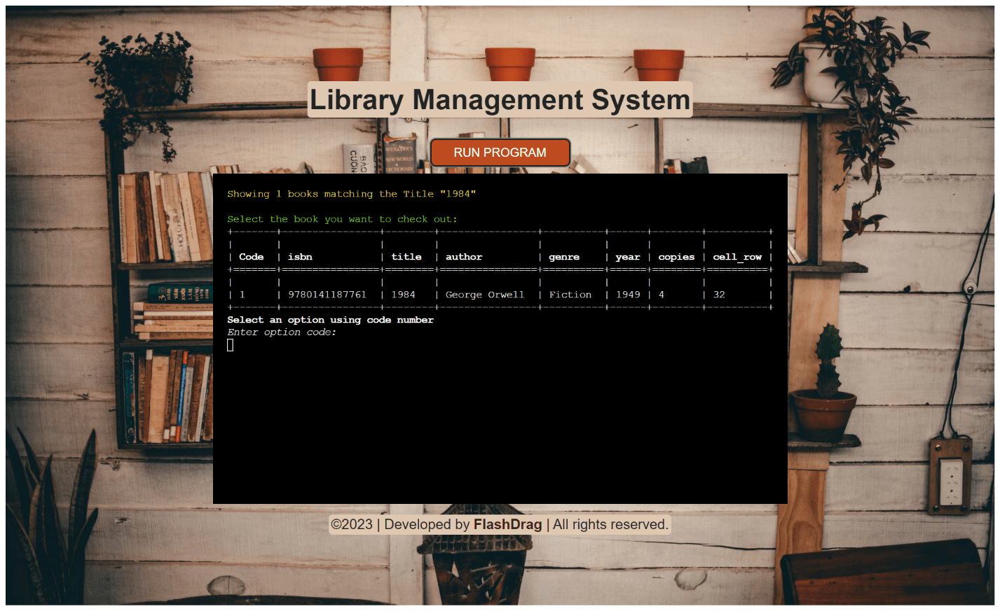

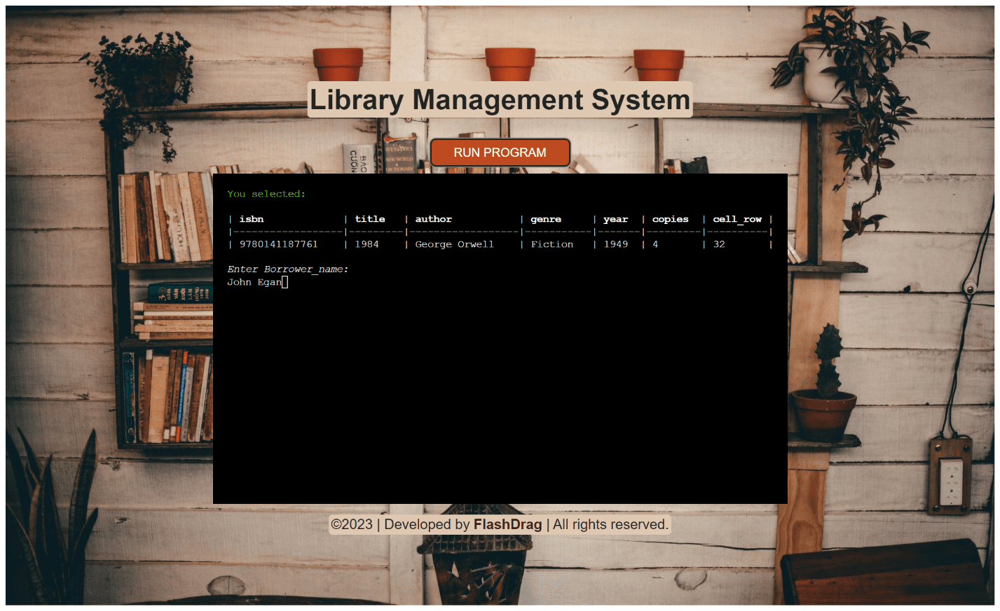

----

<i>Another example of checking out a book.</i>

Completely checked out a book from the 'stock' as no copies left

- #### Return book
The `Return book` option allows the librarian to return a book to the library stock. The librarian can choose the field to search by.

Avialable search fields are: `ISBN`, `Title`, `Author`, `Genre`, `Year`, `Borrower name`, `Borrow date`, `Due date`. The book will be searched for in the `borrowed` worksheet by the selected field and entered validated value.

Each value will be validated to ensure that is not empty. Besides that `ISBN` must be 13 digits long, `Year` must be a digit and cannot be greater than the current year, `Borrow date` cannot be greater than the current date and `Due date` can be any date. `Borrow date` and `Due date` must be in one of the following formats: 'dd/mm/yyyy', 'dd-mm-yyyy', 'dd.mm.yyyy'.

All found books that matching entered value in the selected column will be displayed and the user will be prompted to select a book to return.
Once the book is selected, the app will search for the book in the `stock` worksheet by the `ISBN` field and if the book is found, the number of copies will be increased by one and the book will be updated in the `stock` worksheet and removed from the `borrowed` worksheet. If the book is not found in the `stock` worksheet, the book will be added to the end of the `stock` worksheet with one copy and removed from the `borrowed` worksheet.
Updated book will be displayed to the user with the full information about the book, updated number of copies and number of row in the `stock` worksheet.

Return book

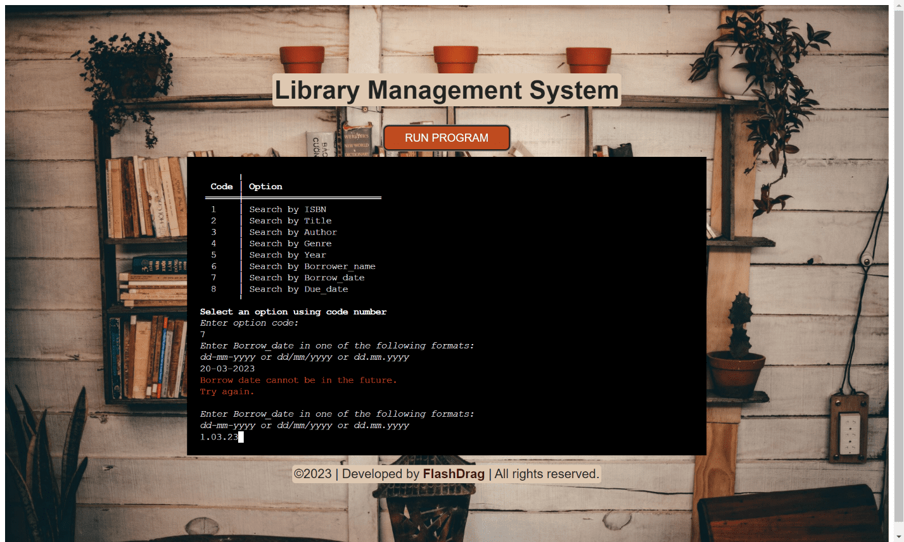

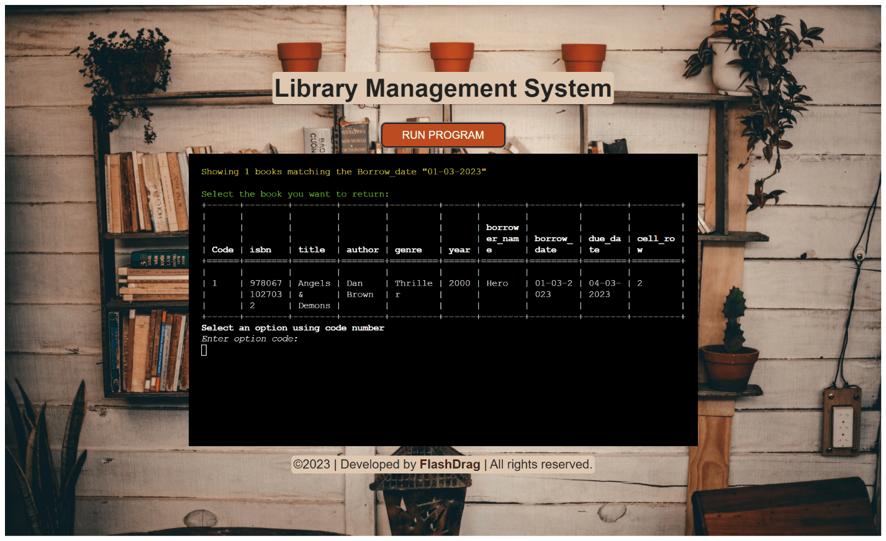

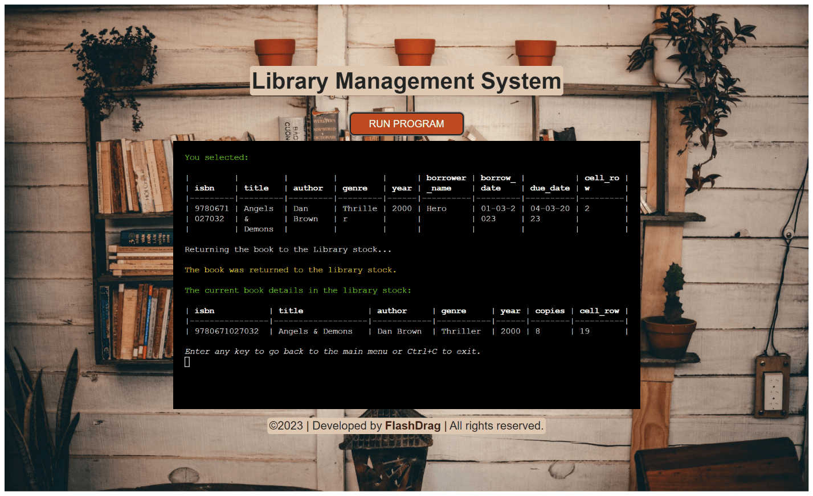

- #### Check Overdue borrowers

- #### View library stock

[Back to top](#table-of-contents)

### Development features

#### MVC Model

#### OOP Approach

#### API Integration

#### Data model

#### Type Hints

#### Pydantic Validation

#### Enum, TypedDict

#### Rich table

#### Logging

#### Error handling

[Back to top](#table-of-contents)

## Technologies Used
- [Python](#) - building the app
- [VSCode](#) - IDE
- [GitHub]() - ...
- [GIT]() - ...
- [Heroku]() - ...
- [Google Spreadsheets API]() - ...
-  - ...
-  - ...
-  - ...
-  - ...
-  - ...
-  - ...

### Dependencies
- [Pytest]() - ...
- [datetime]() - ...
- [Pydantic]() - ...
- [gspread]() - Python library used to access and manage Google Spreadsheets.
- [flake8]() - ...
- [logtail]() - ...
- [mypy]() - ...
- [tabulate]() - ...
- [Google OAuth2 client]() - authenticate the application and grant it access to the Google APIs.
-  - ...

[Back to top](#table-of-contents)

## Testing
See [TESTING.md](https://github.com/FlashDrag/library-management-system/blob/main/docs/testing.md) for an overview of the app testing and debugging.

[Back to top](#table-of-contents)

## Deployment
The App link is https://library-management-system.herokuapp.com/

The app is hosted on [Heroku]()

#### How to connect to Google Spreadsheet API and get creadentials

[Here you can find instructions](https://github.com/FlashDrag/love-sandwiches/blob/main/docs/instruction.md)

#### To run the app on a local machine:
To run this script, you need to have the following installed:
- Python 3.x
- gspread library
- Google API credentials (in form of a JSON file)
To run:
- Clone this repository to your local machine
- Replace the credentials JSON file with your own Google API credentials;
- Run the script by executing python run.py in the terminal

#### To deploy the project:

- ##### Creating the Heroku app
1. When you create the app, you will need to add two buildpacks from the _Settings_ tab. The ordering is as follows:
    1. `heroku/python`
    2. `heroku/nodejs`

2. Config Vars
- Create a _Config Var_ called `PORT`. Set this to `8000`
- Create another _Config Var_ called `CREDS` and paste the JSON credentials into the value field.

3. Connect your GitHub repository and deploy as normal.

----
- Fork or clone this repository.
- Log into your account on Heroku.
- Create a new Heroku app.
- Navigate to Settings tab.
- Set up environmental variables in config vars section. In this case, it's CREDS(credentials of Google service account) and PORT(value 8000).
- Set the buildbacks to python and NodeJS in that order.
- Configure GitHub integration, choose main branch in the Deploy tab.
- Click Deploy branch.
----
[Back to top](#table-of-contents)

## Constraints

The deployment terminal is set to 80 columns by 24 rows. That means that each line of text needs to be 80 characters or less otherwise it will be wrapped onto a second line.

[Back to top](#table-of-contents)

## Credits
### Code
The [Library Management System](https://library-management-system.herokuapp.com/) programm based on my own implementation of code, applying what I've learned from [CodeInstitute Full Stack Developer Course](https://codeinstitute.net/ie/full-stack-software-development-diploma/) and other tutorials.

### Content
...

[Back to top](#table-of-contents)