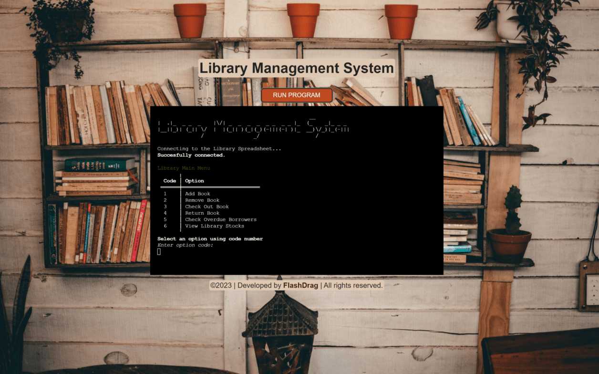

# Library Management System

## Overview
[Library Management System](https://library-management-system.herokuapp.com/) is a Python CLI application designed to manage a library's book inventory using a Google Spreadsheet API. The library management system allows the librarian to add and remove, check out and return books, as well as to view the list of all books in the library stock sorted by specific fields (author, title, genre, etc.) or view the list of books that are currently checked out or overdue.

The app is built based on the MVC model that allows separating access to the data and operations on it from the user interface.

The app uses the Pydantic model for data validation which provides a convenient way to validate data using type hints and provides clear error messages if the data is invalid.

[App link](https://library-management-system.herokuapp.com/)

[SpreadSheet](https://docs.google.com/spreadsheets/d/1guVUVRVMsu2nebKllN6_58nDraMnEftIoTaRtlUnRME/edit?usp=sharing)

## Table of Contents
- [**User Experience UX**](#user-experience-ux)
  - [User Stories](#user-stories)
  - [Structure](#structure)
  - [Flowchart](#flowchart)
- [**Features**](#features)
    - [Main menu](#main-menu)
    - [Add book](#add-book)
    - [Remove book](#remove-book)
    - [Check out book](#check-out-book)
    - [Return book](#return-book)
  - [MVC Model](#mvc-model)
  - 
  - 
  - 
  - 

- [**Technologies Used**](#technologies-used)
- [**Testing**](#testing)
- [**Deployment**](#deployment)
- [**Credits**](#credits)

## User Experience (UX)

### User Stories
- #### Librarian goals
    - As a librarian, I want to be able to add a new book to the library stock.
    - As a librarian, I want to be able to add some copies of a existed book to the library stock by specific field (ISBN, title, author, etc.)

    - As a librarian, I want to be able to remove a some copies of a existed book from the library stock.
    - As a librarian, I want to be able to remove a full book from the library stock.

    - As a librarian, I want to be able to check out a book from the library.
    - As a librarian, I want to be able to return a book to the library.

    - As a librarian, I want to be able to see the list of all books in the library stock.
    - As a librarian, I want to be able to see the list of books by specific field (author, title, genre etc.) in the library stock.

    - As a librarian, I want to be able to see the all books that are currently checked out.
    - As a librarian, I want to be able to see the list of books that are overdue.

    - As a librarian, I want to be able to find a book by specific field (author, title, genre etc.) in the library stock.
    - As a librarian, I want to be able to find a book by specific field (title, borrower, borrow_date etc.) in the `borrowed` worksheet.

[Back to top](#table-of-contents)

### Structure

...

[Back to top](#table-of-contents)

### Flowchart

## Features
- #### Main menu
    The main menu is the first screen that the user sees when the app is launched. It provides a list of options to the user in tabular format. Each option is represented by a code number to be entered by the user. The user can enter the code number of the option they want to choose. The app will then perform the action associated with that option.

- #### Add book

- #### Remove book

- #### Check out book

- #### Return book

### MVC Model

### API Integration

### Type Hints

### Pydantic Validation

### Enum, TypedDict

### Tabulate

[Back to top](#table-of-contents)

## Technologies Used
- [Python](#) - building the app
- [VSCode](#) - IDE
- [GitHub]() - ...
- [GIT]() - ...
- [Heroku]() - ...
- [Google Spreadsheets API]() - ...
-  - ...
-  - ...
-  - ...
-  - ...
-  - ...
-  - ...

### Dependencies
- [Pytest]() - ...
- [datetime]() - ...
- [Pydantic]() - ...
- [gspread]() - Python library used to access and manage Google Spreadsheets.
- [flake8]() - ...
- [logtail]() - ...
- [mypy]() - ...
- [tabulate]() - ...
- [Google OAuth2 client]() - authenticate the application and grant it access to the Google APIs.
-  - ...

[Back to top](#table-of-contents)

## Testing
See [TESTING.md](https://github.com/FlashDrag/library-management-system/blob/main/docs/testing.md) for an overview of the game testing and debugging.

[Back to top](#table-of-contents)

## Deployment
The App link is https://library-management-system.herokuapp.com/

The app is hosted on [Heroku]()

#### How to connect to Google Spreadsheet API and get creadentials

[Here you can find instructions](https://github.com/FlashDrag/love-sandwiches/blob/main/docs/instruction.md)

#### To run the game on a local machine:
To run this script, you need to have the following installed:
- Python 3.x
- gspread library
- Google API credentials (in form of a JSON file)
To run:
- Clone this repository to your local machine
- Replace the credentials JSON file with your own Google API credentials;
- Run the script by executing python run.py in the terminal

#### To deploy the project:

- ##### Creating the Heroku app
1. When you create the app, you will need to add two buildpacks from the _Settings_ tab. The ordering is as follows:
    1. `heroku/python`
    2. `heroku/nodejs`

2. Config Vars
- Create a _Config Var_ called `PORT`. Set this to `8000`
- Create another _Config Var_ called `CREDS` and paste the JSON credentials into the value field.

3. Connect your GitHub repository and deploy as normal.

----
- Fork or clone this repository.
- Log into your account on Heroku.
- Create a new Heroku app.
- Navigate to Settings tab.
- Set up environmental variables in config vars section. In this case, it's CREDS(credentials of Google service account) and PORT(value 8000).
- Set the buildbacks to python and NodeJS in that order.
- Configure GitHub integration, choose main branch in the Deploy tab.
- Click Deploy branch.
----
[Back to top](#table-of-contents)

## Constraints

The deployment terminal is set to 80 columns by 24 rows. That means that each line of text needs to be 80 characters or less otherwise it will be wrapped onto a second line.

[Back to top](#table-of-contents)

## Credits
### Code
The [Library Management System](https://library-management-system.herokuapp.com/) programm based on my own implementation of code, applying what I've learned from [CodeInstitute Full Stack Developer Course](https://codeinstitute.net/ie/full-stack-software-development-diploma/) and other tutorials.

### Content
...

[Back to top](#table-of-contents)