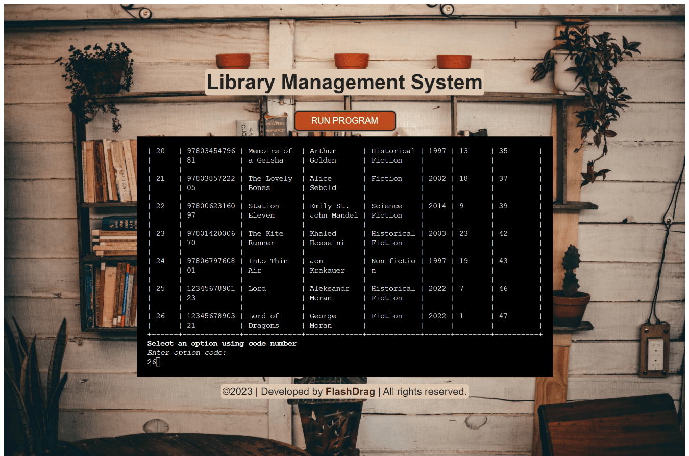

# Library Management System

## Overview
[Library Management System](https://library-management-system.herokuapp.com/) is a Python CLI application designed to manage a library's book inventory using a Google Spreadsheet API. The library management system allows the librarian to add and remove, check out and return books, as well as to view the list of all books in the library stock sorted by specific fields (author, title, genre, etc.) or view the list of books that are currently checked out or overdue.

The app is built based on the MVC model that allows separating access to the data and operations on it from the user interface.

The app uses the Pydantic model for data validation which provides a convenient way to validate data using type hints and provides clear error messages if the data is invalid.

[App link](https://library-management-system.herokuapp.com/)

[SpreadSheet](https://docs.google.com/spreadsheets/d/1guVUVRVMsu2nebKllN6_58nDraMnEftIoTaRtlUnRME/edit?usp=sharing)

## Table of Contents
- [**User Experience UX**](#user-experience-ux)
  - [User Stories](#user-stories)
  - [Structure](#structure)
    - [Flowchart](#flowchart)
- [**Features**](#features)
  - [App features](#app-features)
    - [Main menu](#main-menu)
    - [Add book](#add-book)
    - [Remove book](#remove-book)
    - [Check out book](#check-out-book)
    - [Return book](#return-book)
    - [Check Overdue borrowers](#check-overdue-borrowers)
    - [View library stock](#view-library-stock)
  - [Development features](#development-features)
    - [MVC model](#mvc-model)
      - [Model and Pydantic Validation](#model-and-pydantic-validation)
      - [View](#view)
      - [Controller](#controller)
    - [OOP Approach](#oop-approach)
    - [Data model](#data-model)
    - [Type Hints, mypy, flake8](#type-hints-mypy-flake8)
    - [Enum, TypedDict](#enum-typeddict)
    - [Rich library](#rich-library)
    - [Logging](#logging)
- [**Technologies Used**](#technologies-used)
- [**Dependencies**](#dependencies)
- [**Testing**](#testing)
- [**Deployment**](#deployment)
- [**Credits**](#credits)
- [**Contact**](#contact)

## User Experience (UX)

### User Stories
- #### Librarian goals
    - As a librarian, I want to be able to add a new book to the library stock.
    - As a librarian, I want to be able to add some copies of a existed book to the library stock by specific field (ISBN, title, author, etc.)

    - As a librarian, I want to be able to remove some copies of a existed book from the library stock.
    - As a librarian, I want to be able to completely remove a book from the library stock.

    - As a librarian, I want to be able to check out a book for a specific borrower.
    - As a librarian, I want to be able to return a book to the library.

    - As a librarian, I want to be able to see the list of all books in the library stock.
    - As a librarian, I want to be able to see the list of books sorted by specific field (author, title, genre, date etc.) in the library stock.

    - As a librarian, I want to be able to see the all books that are currently checked out.
    - As a librarian, I want to be able to see the list of books that are currently checked out sorted by specific field (title, borrower, borrow_date, due_date etc.) in the `borrowed` worksheet.
    - As a librarian, I want to be able to see the list of books that are overdue.

[Back to top](#table-of-contents)

### Structure
The library management system is a terminal-based application that is presented in a one-page menu. The main menu is displayed when the app is launched. Each menu provide a list of options to the user in tabular format. Each option is represented by a code number to be entered by the user. The user can enter the code number of the option they want to choose. The app will then perform the action associated with that option. The code approach allows the user to navigate the app without having to type in full words or letters, which makes the app more user-friendly and easier to use.

#### Flowchart
The flowchart was designed in [Microsoft Visio](). It shows the main flow of the app and the main functions that are used to perform the actions.

[Back to top](#table-of-contents)

## Features

### App features

#### Main menu
  The main menu is the first screen that the user sees when the app is launched. It provides a list of options to the user in tabular format. Each option is represented by a code number to be entered by the user. The user can enter the code number of the option they want to choose. The app will then perform the action associated with that option.

The main menu provides the following options

- #### Add book
  The `Add book` option allows the librarian to add a book to the library stock. The librarian can add a new book or add some copies of a existed book to the library stock by specific field (ISBN, title, author, etc.).

  Librarian can choose the field to search by. Then the librarian will be asked to enter the value of the field to search for. If value is valid, the book will be searched for in the `stock` worksheet by the selected field and validated value. All found books that match entered value in the selected specific field column will be displayed in tabular format and the librarian will be prompted to select a book to add copies to.

  If initially, the first selected field was `ISBN` and book not found, the user will be prompted to enter the rest book details manually (title, author, genre, year and number of copies).

  If initially, the first selected field other than `ISBN` and book not found, the user will be prompted to enter the book `ISBN` and the rest book details manually (title, author, genre, year and number of copies). After receiving the `ISBN` value, the app will search for the book with the same `ISBN` in the `stock` worksheet. If the book with the same `ISBN` already exists in the `stock` worksheet, the user cannot add a new book with the same `ISBN` and existing book will be displayed to the user and the user will be asked to choose the book to add copies to.

  After the user has selected the book to add copies to, the app will prompts the user to enter the number of copies to add. If the number of copies is valid (must be digit and in range 1-10), the number of copies will be added to the selected book and the book will be updated in the `stock` worksheet.
  Updated book will be displayed to the user with the full information about the book, updated number of copies and number of row in the `stock` worksheet.

Add book

- #### Remove book
  The `Remove book` option allows the librarian to remove a book from the library stock. The librarian can remove some copies of a existed book or completely remove a book from the library stock.

  Librarian can choose the field to search by. Book will be searched for in the `stock` worksheet by the selected field and validated value. All found books that match entered value in the selected specific field column will be displayed in tabular format and the librarian will be prompted to select a book to remove copies from or completely remove the book.

  If the book has no copies left, the book will be completely removed from the `stock` worksheet and the user will be notified.

  If the book value not found, the user will be notified that no books match the entered value in the selected specific field column and then returned to field selection.

  If the user removes some copies of a book, and the book has some copies left, the book will be updated in the `stock` worksheet and the updated book will be displayed to the user with the full information about the book, updated number of copies and number of row in the `stock` worksheet.

Remove book

---

<i>Another example of removing book.</i>

Completely removing a book if entered number of copies to remove is equal or greater than the number of copies in the library stock.

---

<i>Another example of removing book.</i>

Removing some copies of a book.

- #### Check out book
The check out book option allows the librarian to check out a book to a borrower. Check out system uses the same search system as the `Add book` and `Remove book` options. The librarian can choose the field to search by. The book will be searched for in the `stock` worksheet by the selected field and entered validated value. The validation is used to ensure that the entered value is not empty and is of the correct type.

All found books that matching entered value in the selected column will be displayed and the user will be prompted to select a book to check out.
Only one copy of the book can be checked out to a borrower at a time.

Once the book is selected, the user will be prompted to enter the borrower's name. Then the entered name will be validated to ensure that the value is not empty. If the value is valid, the user will be asked to enter due date in one of the following formats: `dd/mm/yyyy`, `dd-mm-yyyy`, `dd.mm.yyyy`. Then the entered date will be validated using 'dateutils' parser to ensure that the value can be converted to a datetime object. If the value successfully converted to a datetime object, the app checks if the due date is in the future. When all checks are passed, the one copy of the book will be checked out from the 'stock' to the borrower and added to the `borrowed` worksheet with full information about the book, borrower name, borrow date and due date. The borrow date set to the current date automatically. Updated book with subtracted one copy will be displayed to the user. If the book has no copies left, the book will be completely removed from the `stock` worksheet and the user will be notified.

Check out book

----

<i>Another example of checking out a book.</i>

Completely checked out a book from the 'stock' as no copies left

- #### Return book
The `Return book` option allows the librarian to return a book to the library stock. The librarian can choose the field to search by.

Avialable search fields are: `ISBN`, `Title`, `Author`, `Genre`, `Year`, `Borrower name`, `Borrow date`, `Due date`. The book will be searched for in the `borrowed` worksheet by the selected field and entered validated value.

Each value will be validated to ensure that is not empty. Besides that `ISBN` must be 13 digits long, `Year` must be a digit and cannot be greater than the current year, `Borrow date` cannot be greater than the current date and `Due date` can be any date. `Borrow date` and `Due date` must be in one of the following formats: `dd/mm/yyyy`, `dd-mm-yyyy`, `dd.mm.yyyy`.

All found books that matching entered value in the selected column will be displayed and the user will be prompted to select a book to return.
Once the book is selected, the app will search for the book in the `stock` worksheet by the `ISBN` field and if the book is found, the number of copies will be increased by one and the book will be updated in the `stock` worksheet and removed from the `borrowed` worksheet. If the book is not found in the `stock` worksheet, the book will be added to the end of the `stock` worksheet with one copy and removed from the `borrowed` worksheet.
Updated book will be displayed to the user with the full information about the book, updated number of copies and number of row in the `stock` worksheet.

Return book

- #### Check Overdue borrowers
The `Check Overdue borrowers` is a special feature that allows librarians to quickly identify borrowers who have overdue books. When the user selects this option, the app will search for all books in the `borrowed` worksheet that have a due date that is less than the current date. All found books will be sorted by the due date in <em>ascending order</em> and displayed to the user with the full information about books, borrower names, borrow dates, due dates and row numbers in the `borrowed` worksheet. This feature will help librarians stay on top of overdue books and ensures that borrowers are notified promptly to return the books they have borrowed.
By using this command line interface, librarians will easily perform this check at any time, without having to manually sift through spreadsheet records.
If there are no overdue books, the librarian will be notified.

Check Overdue borrowers

- #### View library stock
The `View library stock` option allows the librarian to view the entire inventory of books.

The librarian will be prompted to select the `Library stock` or `Borrowed books` worksheet to view. The `stock` worksheet contains all books that are currently in stock and the `borrowed` worksheet contains all books that have been checked out to borrowers.

When the worksheet is selected, the app will prompt the user to select the sorting field. The sorting field can be any of the following for the `stock` worksheet: `Spreadsheet order`, `ISBN`, `Title`, `Author`, `Genre`, `Year`, `Copies` and for the `borrowed` worksheet: `Spreadsheet order`, `ISBN`, `Title`, `Author`, `Genre`, `Year`, `Borrower name`, `Borrow date`, `Due date`. The `Spreadsheet order` option will display the worksheet in the order it is stored in the spreadsheet.

Once the sorting field is selected, the user will be prompted to select the sorting order. The sorting order can be `Ascending` or `Descending`. The app will then sort the selected worksheet by the selected field in the selected order and display the sorted worksheet to the user in tabular format with the full information about books and row numbers in the worksheet.

<em>Values by which sorting is carried out are validated to implement the correct sorting. If some value did not pass validation and has an incorrect format for its field, it will be moved to the end of the displayed table. For example, if the sorting field is `due date` and some book has a value `30-02/2023` in the `due_date` field, it will be displayed at the end of the table, because the value `30-02/2023` is not a valid date format and cannot be sorted correctly. The same applies to other fields.

Such cases are unlikely to occur if the book is added to the stock using this application since all data is validated when the book is added to the stock. The last screenshot is given as an example, and the invalid date was especially entered manually into the spreadsheet to demonstrate the correct sorting of the table.
</em>

The `View library stock` feature provides librarians with an easy way to get a quick overview of the entire inventory and track the availability of books. It also makes it easier to identify books that may need to be reordered or restocked.

View library stock

----

<i>An example of sorting by `due date` field with incorrect value in the `due_date` field.</i>
The book with the incorrect value is displayed at the end of the table.

[Back to top](#table-of-contents)

### Development features

#### MVC Model
The Library Management System CLI Application in Python is designed using the Model-View-Controller (MVC) architectural pattern. This pattern separates the application into three interconnected components: the model, the view, and the controller.

- ##### Model and Pydantic Validation
The model represents the application business logic, validation, `Book` and `Library` models which located in the `models` package. The `spreadsheet` module is responsible for connecting and working with the database which is Google Spreadsheet. `Library` class responsible for the library model. Validation `Book` model is implemented on the base Pydantic model, which actively support typing. Validation logic separated from user interface.
Using the `Pydantic` library allows to reduce the time for creating custom validators, since it has a lot of ready-made validation templates.

- ##### View
The view is represented by the `views` package.
That package contains the `console_ui` module which is responsible for the user interface and interaction with the user. It is a separate module that can be used in other applications.

The `console_ui` module uses the `rich` library to display the result to the user in a more convenient and readable format. Class `Menu` is responsible for displaying the menu and receiving user input.

- ##### Controller
The controller is represented by the `library_manager` package. The managers ties the model and the view together. The `library_manager` is the component that knows about both the model and the view. It receives user input from `console_ui` module from `views` package and passes it to the model which is `spreadsheet` module. The model processes the data and returns the result to the controller. The controller uses the view (`console_ui`) to display the result to the user.

[Back to top](#table-of-contents)

#### OOP Approach
The application is written using the object-oriented programming approach. The `Book` and `Library` classes are located in the `models` package. The `Book` class is responsible for the book model.
Validation of the book takes place at the stage of the user interface using a `Book` class that inherits from the `Pydantic` model.
Each book field is validated with this class and then stored in this `Book` class instance.

The `Library` class is responsible for the library model. The `Library` class contains methods for adding, removing, searching and sorting books. The `Library` class is responsible for the business logic of the application, as well as for storing and retrieving data from the database.

The `Menu` class is responsible for displaying the menu and receiving user input. The `Menu` class is located in the `views` package. This class is responsible for the user interface of the application. The `Menu` class contains methods that use the `rich` library to display menus and results to the user in a more convenient and readable format.

[Back to top](#table-of-contents)

#### Data model
The application is divided into packages and modules.
Separating the business logic from the user interface allows me to make the code more modular and easier to maintain. If I want to change the way the library works, I just modify the Library class without affecting the user interface. Similarly, if I need to change the user interface, I just modify the `console_ui` module that provides it without affecting the library itself.

[Back to top](#table-of-contents)

#### Type Hints, mypy, flake8
Python is a dynamically typed language, which means that data types do not need to be explicitly specified. This makes Python code more flexible and easier to write, but it also makes it more difficult to understand and maintain. Type hints allow you to specify the types of inputs and outputs for the validation methods. This makes the code easier to understand and maintain.

Programs in professional development are developed by more than one person, and often you have to return to them after a certain period of time to fix bugs or add new features. In this case, it is very important to have a clear understanding of the code. But if the code was poorly written, then even the one who wrote it will spend a lot of time in six months to figure it out and remember what's what. Type hinting greatly simplifies the reading of the code and allows even those who have not written this code to quickly scream into the essence and start working with it.

- `Mypy` is a static type checker for Python. The `mypy` extension supports type hinting well. While it doesn't affect how the program works, it does allow the IDE to hint at possible errors. Linter allows you to follow this code according to pip8 rules.
It's a great tool for improving the quality of the code. It works great in combination with type hints. `Mypy` allows to find bugs before the code is executed. It also helps to understand the code better, as well as it is a great tool for refactoring and code review.

- `Flake8` is a tool for style guide enforcement. It checks the code against PEP 8 style guide. It also checks for unused imports, unused variables, and other errors. `Flake8` is also a great tool for refactoring and code review and helps to keep the code clean and consistent.

[Back to top](#table-of-contents)

#### Enum, TypedDict
In my CLI Python app, I use Enum and TypeDict to help organize and validate the input and output of my command-line arguments. The `Enum` class is used to define a set of constants. The `TypedDict` class is used to define a dictionary with a fixed set of keys and their types.

By using Enum and TypeDict, the code is able to enforce constraints on the input and output of the app, making it more robust and maintainable. For example, the `MenuSets` Enum from `menus` module ensures that each menu has the required keys (title, options, table_format), and the `MenuSet` that inherits from TypedDict ensures that the values for these keys are of the expected type (str, list[str], and box.Box, respectively).

[Back to top](#table-of-contents)

#### Rich library
Initially, the `tabulate` library was chosen for data output in tabulate format. However, I faced some challenges when trying to display the full information about the book. The table would break in small terminals, and I had to adjust the width of each column manually, which was not convenient. This became more difficult when the data was dynamic and constantly changing. To solve this problem, I switched to using the `rich` library. The `rich` library provides more flexibility in terms of setting and adjusting column widths, and it can automatically adjust to the size of the terminal. This made it much easier to display the data in a way that was visually appealing and easy to read, even when the data was changing.

While I found the library a little late and did not have enough time to study it well, it was still a valuable tool for displaying dynamic data. That said, when working with large data sets, in some cases, the data is still displayed a little strangely due to the fact that it is hard to fit.

In this project, you will find examples of how to use the `rich` library to display data in tables. You can easily customize the look and feel of the tables to match your needs, and the library is highly versatile and easy to use. If you are looking for a Python library for data output that is flexible and powerful, I highly recommend giving rich a try.

[Back to top](#table-of-contents)

#### Logging
The built-in logging module provides a flexible framework for emitting diagnostic messages from applications.
The Library Management System uses logging to capture errors and other information that may be useful for developers, but should not be displayed to end users. By default, log messages are written to the console. To be able to catch errors remotely and send them to the developer, I used the `logtail` library. This library allows me to send logs to the server and view them in the browser. This is a great tool for debugging and monitoring the application.

[Back to top](#table-of-contents)

## Technologies Used
- [Python](#) - programming language, version 3.11.2
- [HTML5](https://developer.mozilla.org/en-US/docs/Glossary/HTML5) - presenting the app
- [CSS3](https://developer.mozilla.org/en-US/docs/Web/CSS) - styling the app
- [VScode](https://code.visualstudio.com) - IDE used to write the code
- [WSL - Ubuntu](https://ubuntu.com/wsl) - terminal environment
- [GIT](https://git-scm.com/), [GitHub](https://github.com/) - tracking, storing, hosting project
- [Heroku](https://www.heroku.com/) - hosting the app
- [Google Spreadsheets API](https://developers.google.com/sheets/api) - storing the data
- [iloveIMG](https://www.iloveimg.com) - compressing and resizing docs images
- [Microsoft Visio](https://www.microsoft.com/en-us/microsoft-365/visio/flowchart-software) - creating the app flowchart

[Back to top](#table-of-contents)

### Dependencies
- [datetime](https://docs.python.org/3/library/datetime.html) - manipulating dates
- [dateutils](https://dateutil.readthedocs.io/en/stable/) - parsing dates
- [Pydantic](https://pydantic-docs.helpmanual.io/) - data validation and settings management using Python type hinting.
- [gspread](https://gspread.readthedocs.io/en/latest/) - Python library used to access and manage Google Spreadsheets.
- [flake8](https://flake8.pycqa.org/en/latest/) - tool for style guide enforcement.
- [logtail](https://logtail.com/) - remote logging.
- [mypy](https://mypy.readthedocs.io/en/stable/) - static type checker for Python.
- [rich](https://rich.readthedocs.io/en/latest/) - Python library for data output.
- [pycodestyle](https://pycodestyle.pycqa.org/en/latest/) - checking Python code against PEP 8.

[Back to top](#table-of-contents)

## Testing
See [TESTING.md](https://github.com/FlashDrag/library-management-system/blob/main/docs/testing.md) for an overview of the app testing and debugging.

[Back to top](#table-of-contents)

## Deployment
The App link is https://library-management-system.herokuapp.com/

The app is hosted on [Heroku](https://www.heroku.com/). The app is deployed from the main branch on GitHub. The deployment is automatic, so every time a new commit is pushed to the master branch, the app is automatically deployed.

#### How to connect to Google Spreadsheet API and get creadentials

[Here you can find instructions](https://github.com/FlashDrag/library-management-system/blob/main/docs/instruction.md)

#### To run the app on a local machine:
To run this script, you need to have the following installed:
- Python 3.x
- gspread library
- Google API credentials (in form of a JSON file)
To run:
- Clone this repository to your local machine
- Get the credentials [JSON file from Google API](https://github.com/FlashDrag/library-management-system/blob/main/docs/instruction.md);
- Install dependencies by executing `pip install -r requirements.txt` in the terminal;
- Create a file called `creds.json` in the root directory of the project and paste the JSON credentials into it;
- Run the script by executing `python run.py` in the terminal

#### To deploy the project to Heroku:

- ##### Creating the Heroku app
  - Fork or clone this repository.
  - Log into your account on Heroku.
  - Create a new Heroku app.
  - Navigate to Settings tab in your Heroku app.
  - Click on Reveal Config Vars.
  - Set up environmental variables in config vars section:
    - CREDS: paste the JSON credentials into the value field.
    - PORT: 8000
  - Set the buildbacks to python and NodeJS in that order:
    - Click on the _Settings_ tab.
    - Click on the _Buildpacks_ section.
    - Click on the _Add buildpack_ button.
    - Enter `heroku/python` and click _Save_.
    - Click on the _Add buildpack_ button.
    - Enter `heroku/nodejs` and click _Save_.
  - Configure GitHub integration, choose main/master branch in the Deploy tab.
    - Click on the _Deploy_ tab.
    - Click on the _GitHub_ section.
    - Enter your GitHub username and repository name.
    - Click on the _Connect_ button.
    - Click on the _Enable Automatic Deploys_ button to enable automatic deployment.
    - Click on the _Deploy Branch_ button.
  - Click on the _Open App_ button to open the app in the browser.

  Note: if you are using a Heroku with student benefits, the app will go to sleep after 30 minutes of inactivity. The first request after the app has gone to sleep will take a few seconds to load.

#### Terminal app settings

The deployment terminal is set to 90 columns by 24 rows. That means that each line of text needs to be 90 characters or less otherwise it will be wrapped onto a second line.

[Back to top](#table-of-contents)

## Credits
### Code
The [Library Management System](https://library-management-system.herokuapp.com/) programm based on my own implementation of code, applying what I've learned from [CodeInstitute Full Stack Developer Course](https://codeinstitute.net/ie/full-stack-software-development-diploma/) and other tutorials.

### Content
- App background image was taken from [Pexels](https://www.pexels.com/)
- Favicons were taken from [icons8](https://icons8.com/)

- The content of the app was written by developer Pavlo Myskov.

[Back to top](#table-of-contents)

## Contact
- Contact information is available on my [LinkedIn](https://www.linkedin.com/in/pavlo-myskov/) profile.

 

[Back to top](#table-of-contents)